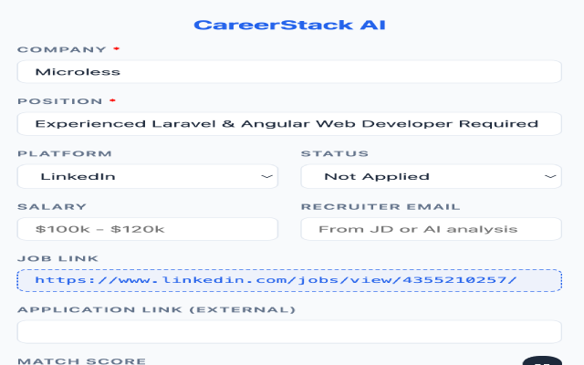

<p align="center">
  
</p>

<h1 align="center">CareerStack AI</h1>

<p align="center">
  <strong>AI-powered job application tracker for Notion — right inside your browser.</strong>
</p>

<p align="center">
  <a href="https://github.com/musavirchukkan/CareerStack-AI/releases/latest"></a>
  <a href="https://github.com/musavirchukkan/CareerStack-AI/blob/main/LICENSE"></a>
  <a href="https://github.com/musavirchukkan/CareerStack-AI/actions"></a>
  <a href="https://github.com/musavirchukkan/CareerStack-AI/issues"></a>
</p>

<p align="center">
  <a href="#-features">Features</a> •
  <a href="#-screenshots">Screenshots</a> •
  <a href="#-installation">Installation</a> •
  <a href="#%EF%B8%8F-configuration">Configuration</a> •
  <a href="#-usage">Usage</a> •
  <a href="#-contributing">Contributing</a> •
  <a href="#-roadmap">Roadmap</a>
</p>

---

## ✨ Features

| Feature                    | Description                                                                                                      |
| -------------------------- | ---------------------------------------------------------------------------------------------------------------- |
| 🔍 **Smart Job Scraping**  | Automatically extracts company name, position, salary, and job URL from LinkedIn & Indeed                        |
| 🤖 **AI-Powered Analysis** | Uses Google Gemini or OpenAI to generate a match score, extract recruiter emails, and summarize job descriptions |
| 📒 **Notion Integration**  | Saves every application to your personal Notion database with one click — including the full job description     |
| 🔄 **Auto-Fetch**          | Optionally scrapes job details as soon as you open a listing — zero clicks needed                                |
| 🧠 **Resume Matching**     | Compares your master resume against each job posting and scores the match                                        |
| 💾 **Smart Caching**       | Caches scrape and AI results in session storage, so switching tabs doesn't lose your work                        |
| 🔒 **Privacy-First**       | All API keys and data stay in your browser's local storage — nothing is sent to our servers                      |

---

## 📸 Screenshots

<details open>
<summary><strong>Extension Popup</strong> — Scrape, analyze & save in one go</summary>
<br/>
<p align="center">
  
  &nbsp;&nbsp;&nbsp;&nbsp;
  
</p>
</details>

<details>
<summary><strong>Options Page</strong> — Configure Notion, AI provider & resume</summary>
<br/>
<p align="center">
  
</p>
<p align="center">
  
</p>
<p align="center">
  
</p>
</details>

---

## 🚀 Installation

### From Release (Recommended)

1. Download **`extension.zip`** from the latest [GitHub Release](https://github.com/musavirchukkan/CareerStack-AI/releases/latest).
2. Unzip the file.
3. Open Chrome and navigate to `chrome://extensions`.
4. Enable **Developer Mode** (toggle in top right).
5. Click **Load Unpacked** and select the unzipped folder.

### From Source

```bash
git clone https://github.com/musavirchukkan/CareerStack-AI.git
cd CareerStack-AI
npm install
npm run build
```

Then load the `dist/` folder as an unpacked extension in Chrome.

> [!TIP]
> For development with hot-reload, run `npm run dev` instead of `npm run build`.

---

## ⚙️ Configuration

Click the **CareerStack AI** icon in the toolbar, then open **Options** (right-click icon → Options).

### 1. Notion Setup

| Step                   | Action                                                                                                                                           |
| ---------------------- | ------------------------------------------------------------------------------------------------------------------------------------------------ |
| **Create Integration** | Go to [notion.so/my-integrations](https://www.notion.so/my-integrations) and create a new integration. Copy the **Internal Integration Secret**. |
| **Create Database**    | Create a new Notion database with the properties listed below.                                                                                   |
| **Share Database**     | Click `···` on the database page → **Connect to** → select your integration.                                                                     |
| **Copy Database ID**   | From the database URL, copy the ID between `notion.so/` and `?v=`.                                                                               |

<details>
<summary><strong>📋 Required Database Properties</strong> (auto-filled by extension)</summary>
<br/>

| Property             | Type   | Description                      |
| -------------------- | ------ | -------------------------------- |
| **Company**          | Title  | Stores the company name          |
| **Position**         | Text   | Job title                        |
| **Status**           | Status | Default: "Not Applied"           |
| **Platform**         | Select | Options: LinkedIn, Indeed, Other |
| **Application Date** | Date   | When saved                       |
| **Email**            | Email  | Recruiter email                  |
| **Source URL**       | URL    | Original job listing URL         |
| **Apply Link**       | URL    | External application link        |
| **Salary**           | Text   | Salary range                     |
| **Match Score**      | Number | AI-calculated match percentage   |

> [!IMPORTANT]
> Property names are **case-sensitive** and must match exactly.

</details>

<details>
<summary><strong>📋 Optional Database Properties</strong> (managed manually)</summary>
<br/>

| Property         | Type         |
| ---------------- | ------------ |
| Hiring Manager   | Text         |
| Interview Date   | Date         |
| Interview Status | Multi-select |
| Keywords         | Multi-select |
| Resume           | Files        |
| Cover Letter     | Files        |
| Place            | Text         |

</details>

### 2. AI Setup

Choose **Google Gemini** or **OpenAI** as your provider and enter your API key.  
Your key is stored locally and never sent to our servers.

### 3. Master Resume

Paste your full resume as plain text or markdown. The AI uses this to compare your profile against job descriptions and generate match scores.

---

## 📖 Usage

### Step 1 — Scrape a Job

Navigate to a job posting on **LinkedIn** or **Indeed** and click the extension icon.  
The company, position, salary, and URL are auto-filled instantly.

### Step 2 — Run AI Analysis

Click **✨ Run AI Analysis** to get:

- A **Match Score** based on your resume
- An extracted **Recruiter Email** (if found)
- A concise **Job Summary**

### Step 3 — Save to Notion

Click **Save to Notion** to push the entry to your database. Open the saved Notion page to view the full job description.

---

## 🛠️ Troubleshooting

| Problem                   | Solution                                                                             |
| ------------------------- | ------------------------------------------------------------------------------------ |
| Job description not found | Make sure you're on the **full job details view**, not the list page                 |
| AI error                  | Verify your API key is valid and you have remaining quota                            |
| Notion error              | Ensure the database is shared with your integration and property names match exactly |
| Stale data                | Use **Clear Cache & Rescrape** in the popup, or clear caches from Options            |

---

## 🤝 Contributing

Contributions are welcome! Please read the [Contributing Guide](CONTRIBUTING.md) for details on our development workflow, commit conventions, and how to submit pull requests.

See also:

- [Build Guide](BUILD.md) — local setup & development
- [Changelog](CHANGELOG.md) — release history

---

## 🗺️ Roadmap

Check out the full [Roadmap](ROADMAP.md) to see what's coming next. Highlights include:

- 🔜 Auto-publish to Chrome Web Store via CI
- 🦊 Firefox support
- 🔎 More job boards (Glassdoor, Monster, Wellfound)
- 📊 Analytics dashboard
- 🌙 Dark mode

> 💡 Have a feature request? [Open an issue](https://github.com/musavirchukkan/CareerStack-AI/issues/new)!

---

## 🔒 Privacy

CareerStack AI is designed with privacy in mind. All API keys and user data remain in your browser's local storage. Read the full [Privacy Policy](PRIVACY_POLICY.md).

---

## 📄 License

This project is licensed under the [MIT License](LICENSE).

---

<p align="center">
  Made with ❤️ by <a href="https://github.com/musavirchukkan">Abdul Musavir Chukkan</a>
</p>
